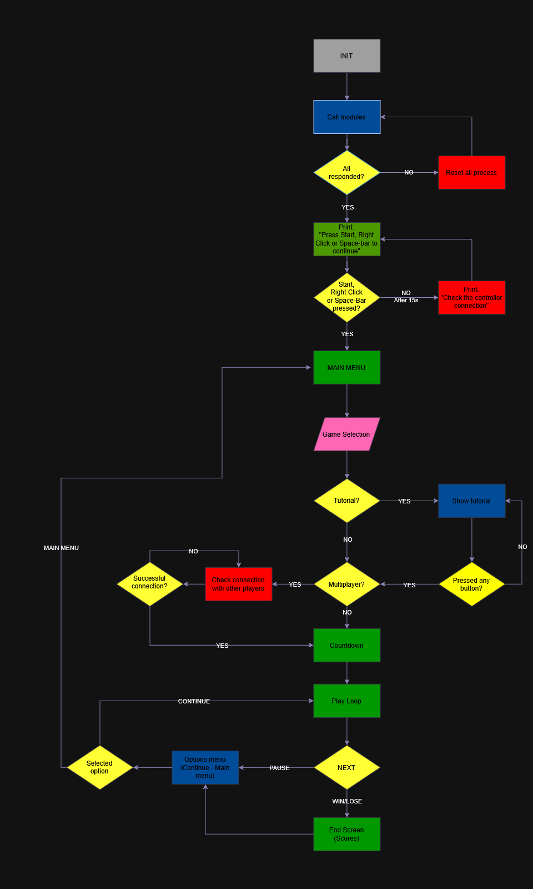

# Tarea 1: Diagrama de bloques general

## Descripción
En este documento presento el diagrama de flujo lógico y la máquina de estados general que propuesto para el sistema de la consola.

El objetivo de este esquema es definir la arquitectura desde el encendido hasta la ejecución, suponiendo la logica y muchos otros procesos como cajas negras que llevan sus propios procesos internos. Este diagrama muestra un flujo general de lo que debe hacer el sistema durante su funcionamiento.

## Esquema propuesto

## Flujo del sistema
El diagrama contempla las siguientes etapas de control:
1. Inicialización (INIT): Llamado a los módulos de hardware y verificación de respuesta. Antes del resto de procesos para detectar fallas antes de que el usuario pueda notar errores.
2. Espera y verificación: Confirmación de que los controles están conectados y funcionando. Apesar de que el sistema internamente tenga el modulo de controles cargado no excluye un error de usuario: al mismo tiempo, el mensaje funciona como una verficicación de que la pantalla este encendida.
3. Selección y configuración: Menú principal, selección de juego, visualización de tutoriales y verificación de conexión para el modo multijugador.
4. Ejecución (Play Loop): Bucle principal donde actúan los submódulos de cada juego de forma independiente.
5. Finalización: Manejo del estado de pausa y pantallas de resultados.

