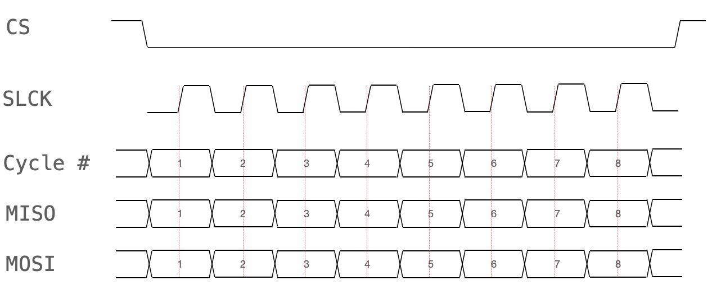
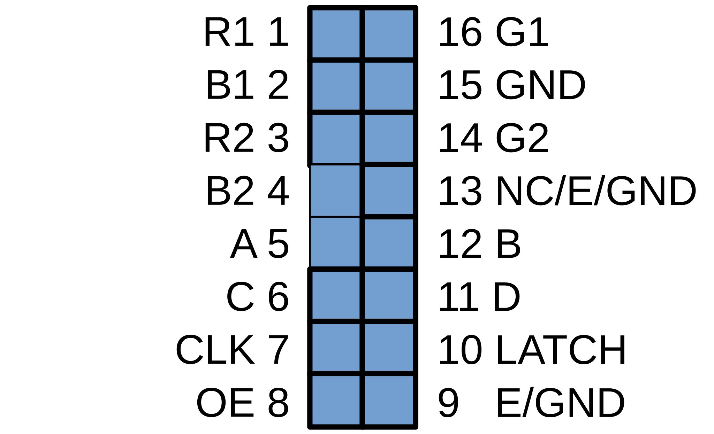
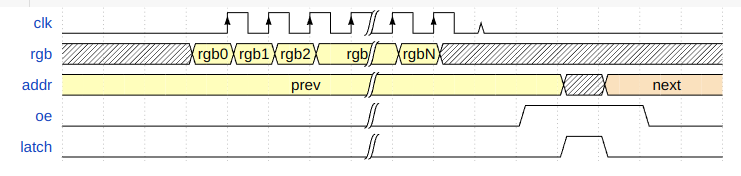
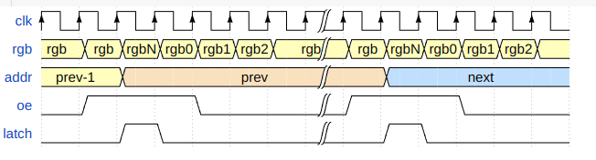

# Protocolos de Comunicación y Control de Pantalla (Display Driver)

En este documento se detalla la interfaz de comunicación del modulo Display Driver. Al ser el driver de video del sistema, el bloque debe manejar dos protocolos distintos: un **Protocolo de Entrada** (para recibir la información gráfica desde la lógica del juego o bram) y un **Protocolo de Salida** (para controlar físicamente la matriz LED).

## 1. Protocolo de Entrada: Framebuffer y Actualización Dinámica

La capa física opera bajo el estándar de comunicación SPI; sin embargo, el módulo de pantalla implementa una capa de aplicación basada en un mapa de memoria (Framebuffer). La lógica del sistema no transmite comandos de alto nivel para el comportamiento de los elementos en el juego, sino que efectúa escrituras directas sobre coordenadas específicas de la memoria de video.

### 1.1. Recepción de Datos y Diagrama de Tiempos
El procesador principal actúa como dispositivo Maestro (Controller) y la FPGA como Esclavo (Peripheral). La comunicación sigue el diagrama de tiempos estándar:
* La señal de selección de chip (`CS` o `NSS`) se pone en estado bajo (0V) para indicar el inicio de una transmisión activa.
* El Controlador genera la señal de reloj (`SCK`)[cite: 8, 9].
* Los datos gráficos se envían a través de la línea `MOSI` (también llamada `COPI`) y son muestreados por nuestro módulo en los flancos correspondientes del reloj[cite: 8, 9].
* La línea `MISO` (`CIPO`) se mantiene inactiva (o en un estado constante) ya que nuestro driver de pantalla solo recibe datos y no necesita responder al controlador[cite: 8, 9].
* Una vez finalizada la transmisión del paquete de datos, la señal `CS` (o `NSS`) vuelve a su estado inactivo en alto[cite: 8, 9].

### 1.2. Protocolo de Actualización de Sprites
El desplazamiento de objetos gráficos en pantalla (sprites) requiere la sobrescritura de los datos previos en memoria. El flujo de actualización ejecutado por la lógica del sistema consta de los siguientes pasos secuenciales:
1. **Borrado (Background):** La lógica envía las coordenadas anteriores del sprite y las pinta del color del fondo (ej. Negro).
2. **Dibujado (Foreground):** La lógica calcula la nueva posición (X, Y) y envía una ráfaga de datos por SPI con los nuevos colores RGB565 para pintar el personaje en su nueva ubicación.
3. **Actualización en Hardware:** El controlador de pantalla recibe la trama de 32 bits (Comando + Coordenada + Color), decodifica la dirección y actualiza de manera síncrona la memoria BRAM interna del framebuffer.

## 2. Protocolo de Salida: Control HUB75 (Matriz LED)

Una vez que la imagen está en la memoria de la FPGA, nuestro driver debe enviarla a la matriz LED. Estos paneles operan mediante un protocolo paralelo de multiplexación y barrido constante denominado HUB75.
Este protocolo exige una sincronización rigurosa generada desde el hardware de la FPGA, controlando las siguientes señales lógicas:

* **Datos RGB (`R1, G1, B1, R2, G2, B2`):** Se envían 2 píxeles al mismo tiempo (uno para la mitad superior de la pantalla y otro para la mitad inferior).
* **Reloj (`CLK`):** Por cada flanco de subida, la matriz desplaza y guarda los colores en sus registros internos (Shift Registers). Se necesitan 64 pulsos de reloj para llenar una fila completa.
* **Output Enable (`OE`):** Señal activa en bajo. Debe ponerse en ALTO (apagar LEDs) mientras se cambia de fila para evitar un efecto de "fantasmeo" (ghosting) o parpadeo. También se modula por ancho de pulso (PWM) para controlar el brillo general o la profundidad de color.
* **Latch / Strobe (`LAT`):** Un pulso rápido en alto al final de los 64 ciclos de reloj para aplicar los datos guardados en los registros a los LEDs visibles.
* **Direccionamiento de Fila (`A, B, C, D, E`):** Pines binarios que seleccionan cuál de las 32 filas físicas de la matriz se va a encender en ese instante.

### Máquina de Estados del Ciclo de Barrido
1. `OE` = 1 (Pantalla apagada).
2. Se cambian los pines `A, B, C, D, E` a la siguiente fila.
3. `OE` = 0 (Pantalla encendida mostrando la fila anterior).
4. Mientras la fila anterior brilla, se envían 64 pulsos de `CLK` empujando los datos RGB de la *nueva* fila.
5. Se envía un pulso de `LAT` para fijar los datos.
6. El ciclo se repite a altísima velocidad (más de 1000 veces por segundo) para engañar al ojo humano y crear una imagen estática estable.

